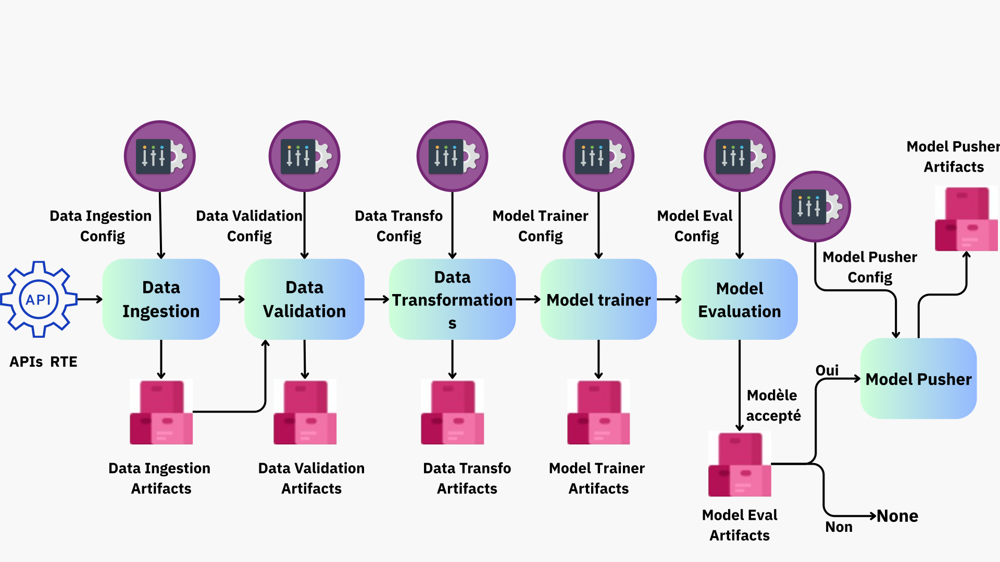

# Prévisions énergétiques (Productions et Consommation)

Ce projet est une application de prédiction et d'analyse des productions et de la consommation énergétique en France.
Elle permet d'estimer, à différents horizons de prévision, la puissance fournie par diverses sources d'énergie ainsi que la demande nationale.

Conçue avec Dash, elle s'appuie sur l'API de RTE et intègre un pipeline ETL complet pour collecter, transformer et exploiter les données en temps réel.

## Architecture du projet



## Structure du projet

```
structure_projet/
├── .github/
│   └── workflows/
├── data_schema/
├── frontend/
├── @images/
├── notebooks/
├── pipeline_prevision/
│   ├── cloud/
│   ├── components/
│   ├── constant/
│   ├── entity/
│   ├── exception/
│   ├── logging/
│   ├── pipeline/
│   └── utils/
│       ├── main_utils/
│       └── ml_utils/
├── .gitignore
├── Dockerfile
├── Procfile
├── main.py
├── app.py
├── requirements.txt
├── setup.py
└── README.md
```
## Installation & Lancement

### Prérequis

- **Python 3.12**
- **Deux clés API RTE** (Production & Consommation)
- **Git**
- *(Optionnel, recommandé pour la production)* Docker

---

### Configuration des variables d’environnement

Créer un fichier `.env` à la racine du projet avec les clés suivantes :

```env
LAT =
LON =
CLIENT_ID=VOTRE_ID_CLIENT_CONSO
CLIENT_SECRET=VOTRE_PASSWORD_CLIENT_CONSO
CLIENT_ID_2=VOTRE_ID_CLIENT_PROD
CLIENT_SECRET_2=VOTRE_PASSWORD_CLIENT_PROD 
```
### Installation locale

```
# 1. Cloner le dépôt
git clone https://github.com/OsmanOSA/projet_prevision_energies_bloc5.git
cd prevision_energetiques

# 2. Créer et activer un environnement virtuel
python -m venv .venv
source .venv/bin/activate       # Linux/MacOS
.venv\Scripts\activate          # Windows

# 3. Installer les dépendances
pip install -r requirements.txt

# 4. Lancer l'application (Dash ou FastAPI selon le point d'entrée)
uvicorn app:app --reload        # Lance FastAPI + Dash (via les routes /docs ou /dashboard)
# ou
python main.py   # Lancer le pipeline d'entrainement
```

### Lancement avec Docker

```
# 1. Construire l'image Docker
docker build -t prevision-energies .
# 2. Lancer l'image
docker run -p 8000:8000 prevision-energies
```
